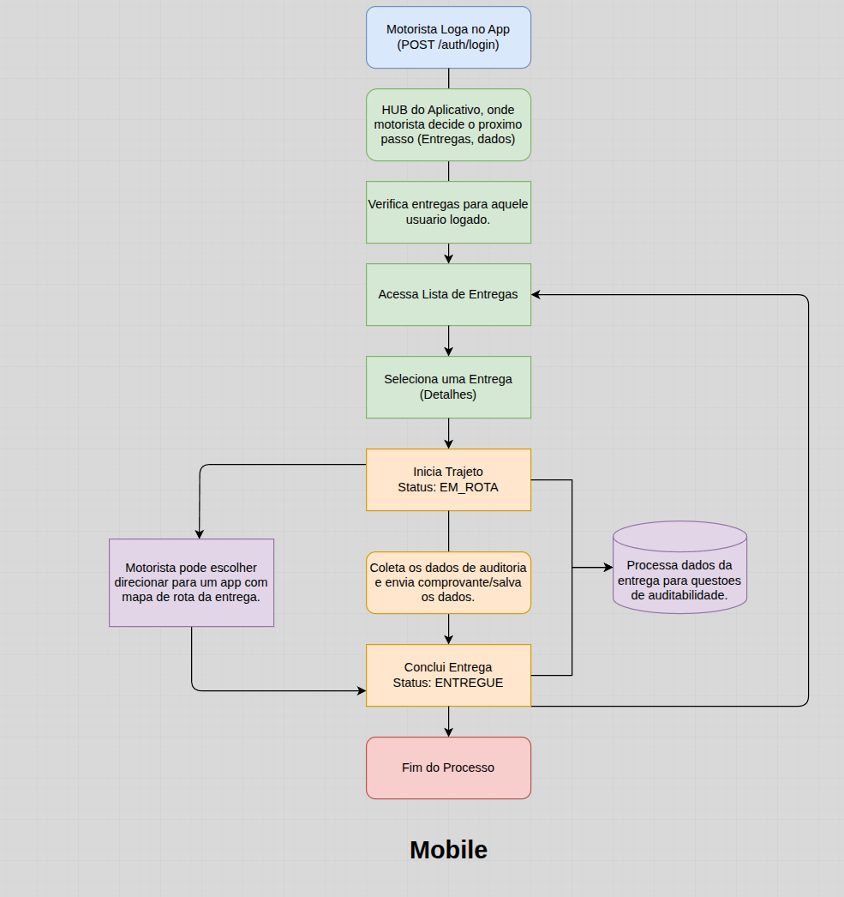
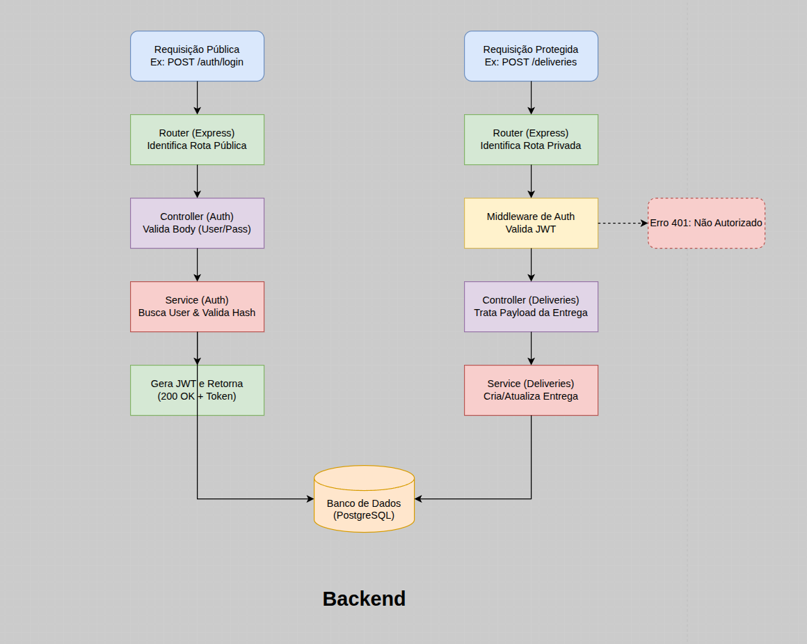
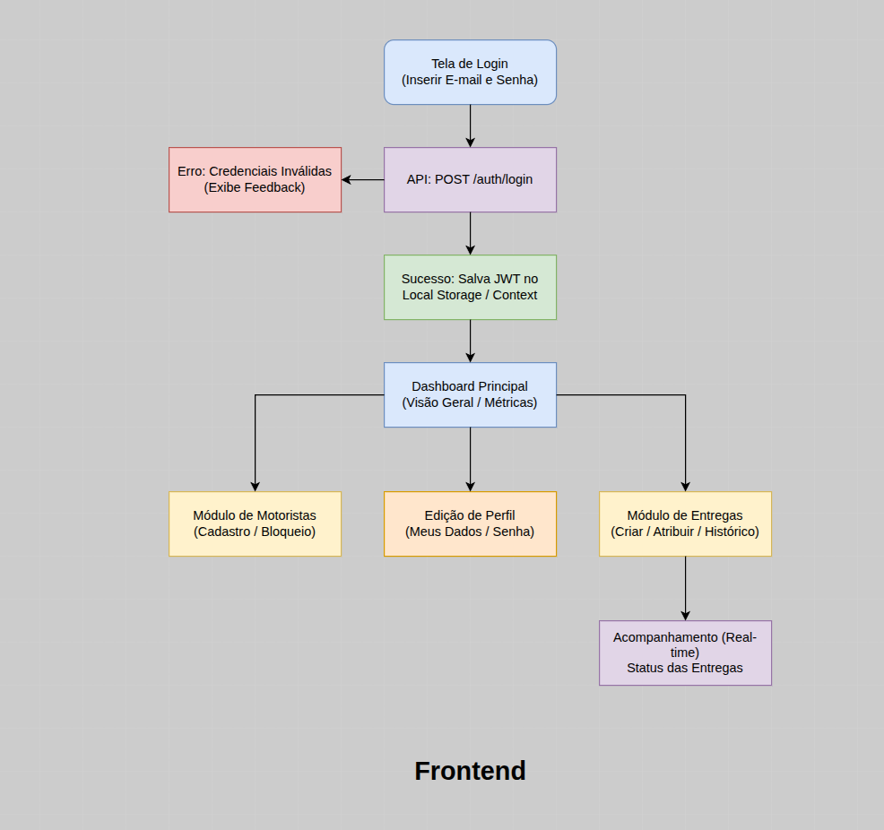

# Documentação do Projeto - Sistema de Entregas

## 1. Fluxo Principal e Regra de Negócio

O fluxo principal do aplicativo reflete a jornada do motorista durante o processo de entrega de ponta a ponta. A regra de negócio principal foca em garantir a segurança e a rastreabilidade das entregas através de autenticação via JWT e atualizações de status em tempo real.

**Registro/Cadastro de entregas por parte da equipe administrativa**
1. O responsavel registra as entregas com os dados.
2. Atribui tal entrega a determinado motorista.
3. Define os dados necessarios.
4. Esses dados serao atribuidos ao motorista, que recebera as entregas que foram determinadas a ele.

**Passo a passo do fluxo Mobile:**
1. **Autenticação:** O Motorista realiza o login no aplicativo (`POST /auth/login`).
2. **Listagem:** Após logado, o motorista acessa a lista de entregas pendentes. O aplicativo faz requisições seguras enviando o token JWT no cabeçalho (Header).
3. **Detalhes da Entrega:** O motorista seleciona uma entrega específica para visualizar os detalhes (endereço, cliente, pacote).
4. **Início do Trajeto:** O motorista inicia o trajeto. O status da entrega muda para `EM_ROTA`. Enquanto tem a opcao de iniciar rota com um aplicativo com mapa/rotas auxiliando na locomocao.
   * *Integração:* O aplicativo avisa a API no Backend, que salva a informação.
5. **Conclusão:** Ao chegar no destino e finalizar, o motorista coleta as informacoes necessarias como dados de gps, assinatura de quem recebeu, envia o comprovante por email e conclui a entrega. O status muda para `ENTREGUE`.
   * *Integração:* Novamente, a API é notificada para atualizar o registro no banco de dados.
6. **Fim do Processo:** O ciclo daquela entrega é encerrado.

### Visão dos Fluxos

Abaixo estão os diagramas com o desenho da regra de negócio de cada frente:

#### 1. Fluxo de Negócio (Mobile -> API)


#### 2. Arquitetura de Requisição (Backend - NestJS)


#### 3. Fluxo de Navegação (Frontend - Next.js)


---

## 2. Stack de Desenvolvimento

A stack tecnológica foi escolhida visando produtividade, forte tipagem, reaproveitamento de conhecimento (uso de TypeScript de ponta a ponta) e estrutura modular.

* **Mobile (Aplicativo do Motorista):** React Native (com React Navigation, Hooks e Context API). Ideal para desenvolvimento ágil multiplataforma (iOS e Android).
* **Backend (API):** NestJS. Framework Node.js fortemente tipado e com arquitetura opinativa (Módulos, Controllers, Providers), utilizando o TypeORM para comunicação com o banco de dados e `@nestjs/jwt` para autenticação.
* **Frontend (Painel Administrativo):** Next.js (com React). Framework React moderno focado em performance, utilizando TailwindCSS para estilização e Server/Client components.
* **Banco de Dados:** MySQL (Relacional). Robusto e perfeitamente integrado ao TypeORM no NestJS, ideal para as relações complexas de Entregas, Motoristas e Rotas.

---

## 3. Arquitetura do Sistema

**Padrão Arquitetural:** Monolito Modular Baseado em Injeção de Dependência (Arquitetura NestJS).

**Motivo da Escolha:**
A arquitetura baseada nos padrões do NestJS divide a aplicação em módulos (Modules), controladores (Controllers) e serviços (Providers/Services). Essa arquitetura resolve problemas de acoplamento garantindo que cada domínio (Auth, Delivery, Driver) seja isolado dentro do mesmo servidor.

Para o momento atual, evita a complexidade de deploy de microserviços, mas como o código já é nativamente modular pelo NestJS, ele está "Microservices-ready". Se a aplicação escalar absurdamente, extrair um módulo do NestJS para um servidor independente é muito mais simples do que separar um monolito Node.js/Express convencional.

---

## 4. Protótipo Estrutural (Estrutura de Pastas)

Abaixo está o esqueleto de como o projeto está estruturado:

```text
/ 
│
├── docs/                     # Documentações e Diagramas (draw.io e imagens)
│
├── mobile/                   # App Motorista (React Native)
│   └── src/                  # (assets, components, contexts, routes, screens, services)
│
├── backend/                  # API Principal (NestJS)
│   ├── src/                  # Módulos principais (auth, driver, delivery, etc)
│   │   ├── main.ts           # Ponto de entrada do NestJS
│   │   └── ...               # Controllers, Modules, Services e Entities (TypeORM)
│   └── package.json          # Dependências (Nest, TypeORM, MySQL2, Passport)
│
└── frontend/dashcontrole/    # Painel Administrativo (Next.js)
    ├── src/                  # Telas e Componentes React
    └── package.json          # Dependências (Next.js, TailwindCSS)
```
